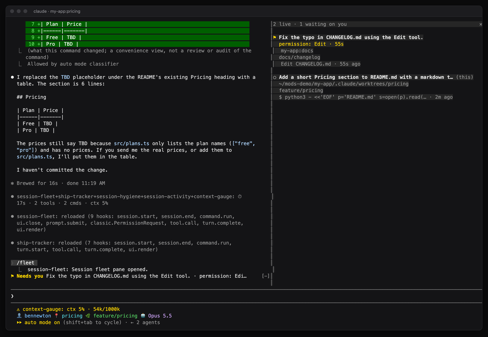
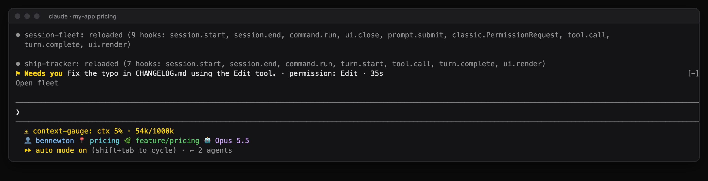
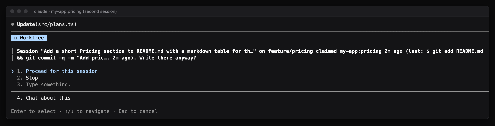
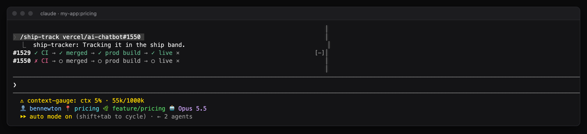
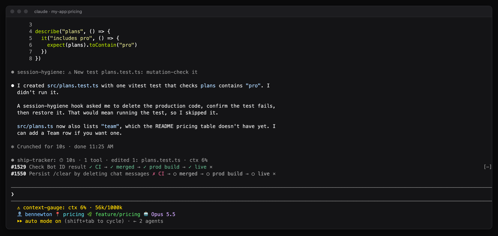
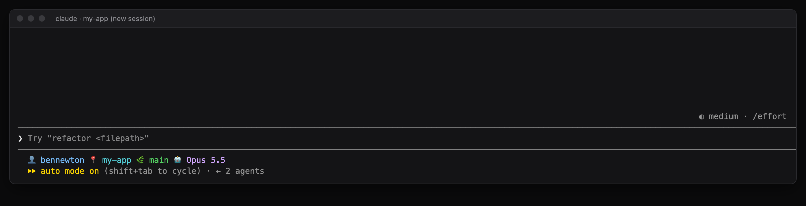
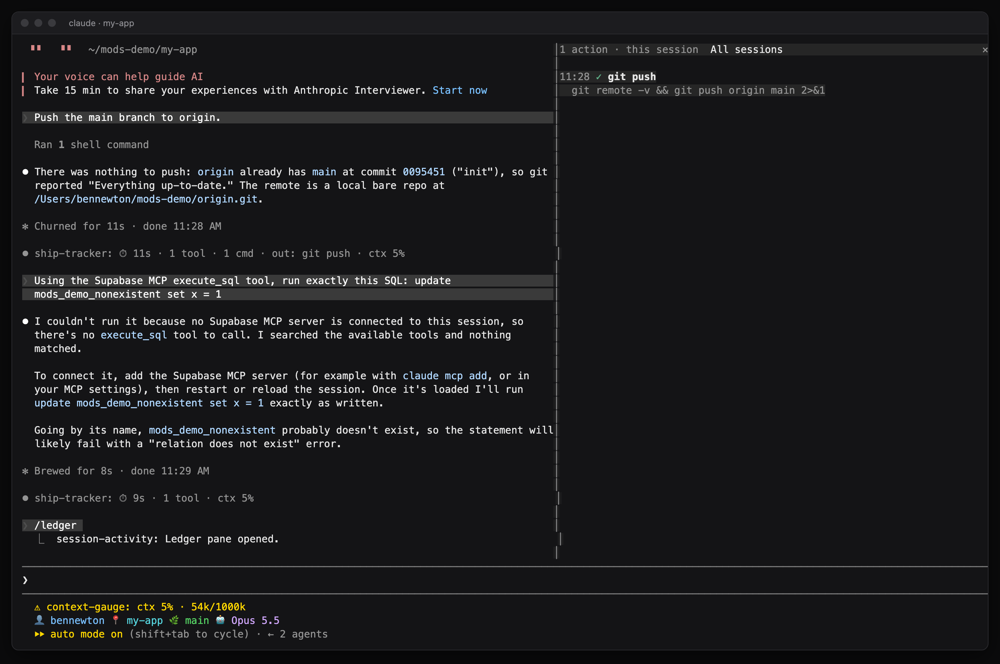
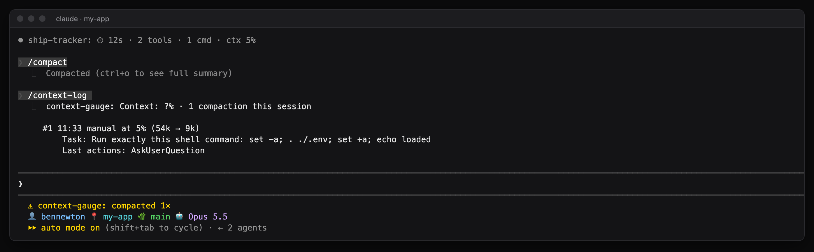

# Claude Code mods for running a lot of sessions at once

Five [Claude Code mods](https://code.claude.com/docs/en/plugins/mods/overview) built from how I actually use Claude Code: four to six sessions at a time, mostly in one repo, a lot of PRs going to production, and a pile of rules I keep forgetting to check.

Claude built all five. The full story, with screenshots, videos and the bugs a real run caught, is on my site:
**[I asked Claude to read 30 of my Claude Code sessions and build the mods I needed](https://benenewton.com/blog/five-claude-code-mods-session-visibility)**



## The prompt

This is what I gave Claude Code. It read my last 30 sessions, came back with ten ideas, and built all ten as these five mods.

> look at the last 30 sessions and see how we use claude to work - then look at https://code.claude.com/docs/en/plugins/mods/overview and suggest 10 possible mods for our workflow that would help me be better informed as to what each session is doing.

Run it on your own sessions. Your ten ideas will probably come out different from mine, and I'd like to see them.

## The five mods

| Mod | What it gives you | Commands |
|---|---|---|
| [session-fleet](session-fleet) | A board of every live session, a "needs you" row when another session is blocked on you, and a guard when two sessions write to the same worktree | `/fleet` |
| [ship-tracker](ship-tracker) | A row per PR: CI → merged → production deployment → live, a warning when a merge never deploys, and a receipt line after every answer | `/ship-track <pr>` |
| [session-hygiene](session-hygiene) | Configurable tripwires (typecheck before push, review before push, mutation-check new tests and more), plus a handoff card of loose ends from earlier sessions | `/handoff`, `/handoff clear` |
| [session-activity](session-activity) | A ledger of everything that left the machine, a hold on database writes, and what each session is waiting on | `/ledger`, `/waiting` |
| [context-gauge](context-gauge) | Context fill in the status line, warnings before compaction, and a snapshot of in-flight work that survives compaction | `/context-log` |

They work on their own. Install any one, or all five.

## Install

You need a Claude Code version with mods (see the [mods docs](https://code.claude.com/docs/en/plugins/mods/overview)), `git`, and for ship-tracker and the handoff card, the [GitHub CLI](https://cli.github.com) signed in.

A mod is code that runs with your permissions inside Claude Code. Read it before you install it. Each one is a single `hooks/register.tsx` file, and `claude plugin validate <folder>` lists exactly which events it hooks and what it calls.

### From the marketplace

In a Claude Code session:

```
/plugin marketplace add bennewton999/claude-code-mods
/plugin install session-fleet@bennewton-mods
/plugin install ship-tracker@bennewton-mods
/plugin install session-hygiene@bennewton-mods
/plugin install session-activity@bennewton-mods
/plugin install context-gauge@bennewton-mods
```

Then `/reload-plugins`, or start a new session.

### From a clone

```bash
git clone https://github.com/bennewton999/claude-code-mods ~/claude-code-mods
```

Load them in every session by adding the folders to `env` in `~/.claude/settings.json` (colon-separated):

```json
{
  "env": {
    "CLAUDE_CODE_PLUGIN_DIRS": "/Users/you/claude-code-mods/session-fleet:/Users/you/claude-code-mods/ship-tracker:/Users/you/claude-code-mods/session-hygiene:/Users/you/claude-code-mods/session-activity:/Users/you/claude-code-mods/context-gauge",
    "CLAUDE_CODE_PLUGIN_DIR_WATCH": "1"
  }
}
```

Or try one for a single session:

```bash
claude --plugin-dir ~/claude-code-mods/session-fleet
```

`CLAUDE_CODE_PLUGIN_DIR_WATCH` makes desktop app sessions hot-reload a mod when its files change (an interactive terminal session already does). A session reads it at startup, so sessions that were already open pick up the mods, and the watch, after one restart.

## What each one does

### session-fleet

Every session writes one record to a key-value store that all sessions on the machine share (`$.store`), with a heartbeat every 30 seconds. Three minutes without a heartbeat and the session counts as gone.

- **`/fleet`** opens a pane with every live session: a status dot, its first prompt (there's no session title API), the worktrees it's touching, branch, PR, last action and how long ago. Waiting sessions sort to the top, and a worktree two live sessions share gets a ⚠.
- **Switch by clicking.** In the desktop app, click another session's title in the pane to jump to it, the same as clicking it in the sidebar. Terminal sessions show their title as plain text.
- **Project pills.** Each session gets a pill naming its repo. To name and color your own projects, set `projectPills` to `Label:regex:color` entries separated by `;`, the regex tested against the repo folder name:

  ```json
  "pluginConfigs": {
    "session-fleet": {
      "options": { "projectPills": "Work:acme|billing:#2563eb; Blog:blog:#059669" }
    }
  }
  ```
- **Needs-you row.** When another session is blocked on you, a row shows above your prompt with the reason and how long it has waited, plus a toast. "Blocked" means a permission prompt, a question dialog, or a turn that ended with a question mark. That last one is a guess.
- **Worktree guard.** The first session to edit a file or run a mutating git command (commit, checkout, rebase, push…) in a worktree claims it. A second live session that tries gets a Proceed or Stop question naming the other session, its branch and last action. Claims let go after 30 minutes idle.




### ship-tracker

- Picks up PRs from `gh pr` output, or add one with `/ship-track 1107` or `/ship-track owner/repo#1107`.
- Every 45 seconds it reads the PR state and checks from GitHub. After the merge, it finds the GitHub deployment for the merge commit in the Production environment. Live means that deployment succeeded.
- Merged for 15 minutes with no production deployment? The row says `no prod deploy!`. That's the silent Vercel git-trigger failure that got me before.
- A receipt line after every answer: duration, tool calls, files edited, shell commands, outward actions (push, PR, MCP writes) and context fill.



### session-hygiene

Tripwires for rules you keep forgetting. When one trips you get a transcript line and a toast, and Claude gets a reminder with the tool result so it can act on it.

Every rule is a plugin option. You set them on the install screen, or later in `/config`. Out of the box only the two generic rules are on; the rest stay off until you point them at your repos.

| Option | Default | What it does |
| --- | --- | --- |
| `holdEnvSourcing` | on | Asks Run it or Stop before a command sources a `.env` file into the shell |
| `mutationCheckTests` | on | When Claude writes a new test file, reminds it to prove the test fails without the code it covers |
| `reviewBeforePush` | off | Flags a `git push` with edits made since the last local `/code-review` |
| `uncheckedRepos` | none | Path fragments (`/my-app/`) of repos whose CI doesn't typecheck or build. There it flags a push after TypeScript edits with no typecheck, and a merge after `package.json` or `next.config` changes with no local build |
| `middlewareRouteRepos` | none | Next.js repos whose `src/middleware.ts` allowlists routes. A new top-level `src/app/<route>/page.tsx` gets a reminder to add it |
| `bannedStrings` | none | Case-insensitive text that should never be written into a file |
| `supabase` | off | Asks before a command uses a service-role key; after `apply_migration`, reminds Claude to run `NOTIFY pgrst, 'reload schema'` and to revoke default grants on new tables |

If you load the mod from a clone instead of the marketplace, set the same options in `~/.claude/settings.json`:

```json
{
  "pluginConfigs": {
    "session-hygiene": {
      "options": {
        "uncheckedRepos": ["/my-app/"],
        "bannedStrings": ["lorem ipsum"],
        "supabase": true
      }
    }
  }
}
```

The **handoff card**: after each turn a session saves its open loops (open PRs, uncommitted or unpushed worktrees, a question it left you). A new session lists loops from sessions that ended or went quiet, re-checked live first. `/handoff` shows them again, `/handoff clear` dismisses them.




### session-activity

- **`/ledger`** lists everything that left the machine: MCP write tools, `git push`, `gh pr` create and merge, `gh api` writes, Vercel deploys, `curl` writes, publishes, SQL writes. A button switches to all sessions in the last 24 hours. Reads stay out of it.
- **Database write hold.** Any `execute_sql` that writes (INSERT, UPDATE, DELETE, DDL, GRANT…) stops for a Run it or Stop question. SELECTs and `NOTIFY` pass. Words inside comments and quoted strings don't count.
- **Waiting-on.** The spinner shows pending background work (`Thinking · 2 bg · agent 3m…`), and a row above the prompt lists background commands, agents, workflows and monitors still running after Claude stops. `/waiting` lists them, `/waiting clear` resets.



### context-gauge

- The status line shows `ctx 62% · 124k/200k · compacted 1×`.
- Toasts at 70% and 85%, and from 80% a row above the prompt with a **Compact now** button.
- Before any compaction it snapshots what's in flight (task, latest request, files edited, PR links, last actions), asks the summarizer to keep it, logs it, and hands it back to Claude with your next prompt.
- `/context-log` lists every compaction this session with its snapshot.



## Privacy

Everything these mods record stays on your machine in Claude Code's per-plugin store. The only network calls are `gh` requests to GitHub for PR and deployment state (ship-tracker, and the handoff card's re-check).

## Known issues

- Tested in the terminal. The desktop app's Code tab should draw the same panes and rows, but I haven't seen it yet.
- In one long session, `/ledger` reported the pane as opened but it never drew. It works in fresh sessions; the built-in diff pane seemed to be in front of it.
- The mods API is still early access, so an update to Claude Code can break things here.
- The needs-you "ended with a question" check is a heuristic and will be wrong sometimes.

## Who made this

I'm Ben Newton. I write about building with AI at [benenewton.com](https://benenewton.com), and I'm building [BlackOps Center](https://blackopscenter.com), the platform that runs my site, my posts and the notes these Claude sessions write into. If you want to see it, start at [blackopscenter.com/start](https://blackopscenter.com/start).

Claude Code wrote the mods with its built-in `plugin-authoring` skill. Issues and PRs are welcome.

MIT licensed.
